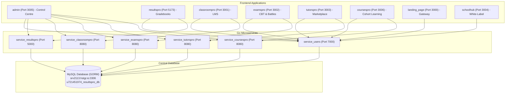

# ResultsPRO Suite — Microservices & Unified Application Platform

The **ResultsPRO Suite** is an enterprise-grade educational technology ecosystem serving primary, secondary, and tertiary institutions across Nigeria and Africa. It unifies student identity, academic records, CBT examinations, classroom learning, private tutoring, and institutional school branding under a distributed Go microservice architecture.

---

## 🏛️ Ecosystem Architecture



---

## 📂 Master Directory Structure

```
resultspro_suite/
├── admin/                 # ⭐ Master Control Centre & Super-Admin Command Hub (Next.js)
├── resultspro/            # ResultsPRO Assessment & Report Card App (Vite + React)
├── classroompro/          # ClassroomPRO LMS & Study Material App (Next.js)
├── examspro/              # examsPRO CBT & Multiplayer Battle Arena (Next.js)
├── tutorspro/             # TutorsPRO Private Tutoring Marketplace (Next.js)
├── landing_page/          # Main Suite Portal & Marketing Gateway (Next.js)
├── schoolhub/             # SchoolHub White-Label Portal & Flutter Mobile App
├── coursespro/            # Courses & Professional Training Platform
│
├── service_users/         # ⚙️ Go 1.23 Microservice (Identity, Academics & Subscriptions)
├── service_resultspro/    # ⚙️ Go 1.23 Microservice (Assessments & Scratch Cards)
├── service_classroompro/  # ⚙️ Go 1.23 Microservice (LMS, Notes & Flashcards SRS)
├── service_examspro/      # ⚙️ Go 1.22 Microservice (CBT Engine & Live Battles)
├── service_tutorspro/     # ⚙️ Go 1.23 Microservice (Tutor Marketplace & Bookings)
├── service_coursespro/    # ⚙️ Go 1.23 Microservice (Cohort OS, Journeys & Submissions)
│
├── .gitignore             # Single Root Git Ignore
└── README.md              # Single Root Ecosystem Reference
```

---

## 🌐 Central Database Topology

All microservices write to the single, centrally managed remote MySQL instance:
* **Host**: `srv2113.hstgr.io` (Port `3306`)
* **Database**: `u721451974_resultspro_db`
* **Username**: `u721451974_resultspro`
* **Password**: `*Reedb4b4`
* **ORM Engine**: [`GORM`](https://gorm.io) (`gorm.io/gorm` with `gorm.io/driver/mysql`)
* **Collation**: `utf8mb4_unicode_ci` (Full emoji and Unicode support)

---

## ⚙️ Microservices Overview

### 1. [`service_users`](./service_users) (Port 7000)
* **Identity & Auth**: Multi-tenant authentication, email OTP verification via AWS SES, Google/Microsoft OAuth 2.0, JWT token rotation, TOTP MFA, and server-to-server token introspection (`POST /auth/introspect`).
* **Institutional Roles**: Multi-role assignment (`student`, `teacher`, `parent`, `school-admin`, `super-admin`, `agent`).
* **White-Label Branding**: Dynamic skinning endpoints for SchoolHub (`logo_url`, `logo_emoji`, theme colors, motto, layout settings).
* **Family Graph**: Parent-child relationship linking and instant validation (`GET /intelligence/verify-relation`).
* **Academics Graph Engine**: Academic sessions (`2025/2026`), terms, class hierarchy, sections, standard subjects, weekly syllabus topics, and national exam standards (WAEC/JAMB).
* **Subscriptions & Invoicing**: Centralized plan limits (`Free`, `Pro`, `Enterprise`), dynamic term boundaries, quota enforcement, and institutional invoices.
* **Agent Network**: Referral portfolios, commission ledgers, and payout withdrawal requests.

### 2. [`service_resultspro`](./service_resultspro) (Port 5000)
* **Assessment Engine**: CAT 1, CAT 2, Term Exam marks entry, psychomotor and affective domain evaluations.
* **Gradebooks**: Automated grade computation, GPA, position in class, and report card PDF exports.
* **Scratch Card Engine**: Cryptographic PIN generation (SHA-256), batch allocation, and parent result verification.

### 3. [`service_classroompro`](./service_classroompro) (Port 8080)
* **LMS Content**: Teacher study handouts, rich lesson notes, and formative quiz question banks.
* **Flashcards SRS**: Spaced Repetition System (SuperMemo-2 algorithm) review queues and study sessions.
* **Gamification**: Study streaks, points, student levels, and badges.

### 4. [`service_examspro`](./service_examspro) (Port 8080)
* **CBT Engine**: Timed testing sessions, randomized question pools, and automated scoring.
* **Live Battle Arena**: Real-time multiplayer academic battles over WebSockets.
* **Question Bank**: WAEC, JAMB, and NECO past question banks.

### 5. [`service_tutorspro`](./service_tutorspro) (Port 8080)
* **Marketplace**: Verified tutor listings, subject specialties, hourly rates, and video introductions.
* **Scheduling**: Calendar availability slots and appointment reservations.
* **Reviews & Payouts**: Verified student reviews, lesson ratings, and tutor withdrawal processing.

### 6. [`service_coursespro`](./service_coursespro) (Port 8080)
* **Cohort Operating System**: 7-Stage learning journeys (*01 Foundational Knowledge → 07 Public Portfolio*).
* **Module Progress**: Real-time progress syncing, reflection submissions, and Bloom's Taxonomy quizzes.
* **Project Submission & Review**: GitHub/Figma submissions, structured rubrics, and video feedback.
* **Classroom Presence & Cowork**: Real-time presence sessions and voice room matchmaking.
* **Public Portfolios**: Employer-ready case study publication with lead mentor endorsements.

---

## 💻 Frontend Applications Overview

### 1. [`admin`](./admin) (Port 3005)
The Master Control Centre for super-administrators:
* Executive live KPI dashboard across all 5 microservices.
* School verification queue (CAC approval, Ministry licenses).
* Universal user search, activation, and suspension controls.
* Subscription plans, limits, and invoice oversight.
* Agent commission payouts authorization.
* Cryptographic scratch card batch generation.
* Blog CMS & AWS SES system-wide email broadcast dispatcher.

### 2. Modular Apps
* [`resultspro`](./resultspro): School admin marks entry and student report card portal.
* [`classroompro`](./classroompro): Interactive digital classroom, student study notes, and flashcards.
* [`examspro`](./examspro): High-stakes examination simulator and battle arena.
* [`tutorspro`](./tutorspro): Tutor discovery and booking marketplace.
* [`landing_page`](./landing_page): Main public gateway and single sign-on portal.
* [`schoolhub`](./schoolhub): White-label branded school portals and mobile app.

---

## 🚀 Quick Start Guide

### Prerequisites
* Go 1.23+
* Node.js 18+
* MySQL 8.0+

### Starting Microservices
```bash
# 1. Start Users & Identity Service
cd service_users && go run main.go

# 2. Start ResultPRO Service
cd service_resultspro && go run main.go

# 3. Start ClassroomPRO Service
cd service_classroompro && go run main.go

# 4. Start examsPRO Service
cd service_examspro && go run cmd/api/main.go

# 5. Start TutorsPRO Service
cd service_tutorspro && go run main.go
```

### Starting Frontend Applications
```bash
# Start Master Admin Control Centre
cd admin && npm install && npm run dev

# Start Landing Page Gateway
cd landing_page && npm install && npm run dev

# Start ResultsPRO App
cd resultspro && npm install && npm run dev
```

---

## 🔒 Security & Introspection Standard
Sub-applications operate under a **Zero-PII** standard:
1. Sub-apps never store local user credentials (passwords, emails, or personal details).
2. Sub-apps store only immutable `user_id` UUIDs.
3. Every session token is verified via `POST http://localhost:7000/auth/introspect` with `X-App-ID` and `X-App-Secret`.
