# Blueprint: Unified Users Microservice (`service_users`)

## 1. Executive Summary

`service_users` is the consolidated relational and identity backbone of the **ResultsPRO Suite** ecosystem. It merges the former `auth_resultspro` (Identity & Session Engine) and `acad_resultspro` (Academic Relational Graph) into a single, high-performance Go microservice.

---

## 2. Core Pillars of Responsibility

```mermaid
graph TD
    A["service_users Microservice"] --> B["Human Identity &amp; Auth"]
    A --> C["Institutional Relationships"]
    A --> D["Academics Graph Engine"]
    A --> E["Central Subscription Engine"]
    A --> F["Agent &amp; Commission Network"]

    B --> B1["Email/Pass, OAuth (Google/Microsoft)"]
    B --> B2["JWT Access &amp; Refresh Token Rotation"]
    B --> B3["TOTP Multi-Factor Authentication"]
    B --> B4["Sub-App Token Introspection"]

    C --> C1["Tenants &amp; Multi-Tenant Organizations"]
    C --> C2["Dynamic TenantHub Skinning &amp; Branding"]
    C --> C3["Role Assignments (Student/Teacher/Admin)"]
    C --> C4["Family Graph (Parent-Child Linking)"]

    D --> D1["Academic Sessions &amp; Terms"]
    D --> D2["Class Hierarchy &amp; Sections"]
    D --> D3["Subjects, Syllabus Weeks &amp; Topics"]
    D --> D4["Student Enrollments &amp; Teacher Assignments"]
    D --> D5["National Curriculums &amp; Exam Syllabi (WAEC/JAMB)"]

    E --> E1["Tier Limits (Free, Basic, Pro, Enterprise)"]
    E --> E2["Resource Quotas (Students, Teachers, Results)"]
    E --> E3["Family &amp; Agent Subscriptions"]

    F --> F1["Agent Tenant Portfolios"]
    F --> F2["Commission Ledgers &amp; Payout Requests"]
```

---

## 3. The Universal Profile Handshake

The cornerstone of the ResultsPRO suite is the **Universal Profile Discovery Handshake** (`GET /intelligence/profile/{userId}` or `GET /api/v1/users/{userId}/profile`).

When any user logs in through the single sign-on gateway:
1. The gateway issues a signed JWT.
2. Any downstream app (`ResultPRO`, `ClassroomPRO`, `examsPRO`, `TutorsPRO`, `TenantHub`) takes the `user_id` and calls `service_users` to resolve context.
3. The handshake returns:
   - **Identity Profile**: Full name, email, avatar, phone, account status.
   - **Tenant Roles**: All tenants where the user has active roles (`student`, `teacher`, `parent`, `tenant-admin`, `super-admin`, `agent`).
   - **Subscriptions**: Tenant-level plan tiers and personal family/agent subscription tiers.
   - **Dependents**: If parent, returns child user IDs, names, and enrolled classes.
   - **Enrollments**: If student, returns class, section, session, and tenant.
   - **Teaching Assignments**: If teacher, returns subjects, classes, sections, and terms.

---

## 4. Database Topology & Charset

- **Engine**: MySQL 8+ / MariaDB with `InnoDB`.
- **Charset & Collation**: `utf8mb4` with `utf8mb4_unicode_ci` for full emoji and international character support (e.g. tenant logo emojis).
- **UUID Strategy**: `VARCHAR(191)` primary keys for seamless distributed UUID generation across microservices.
- **Connection Pool**: 50 max open connections, 25 max idle connections, 5-minute connection recycling.
